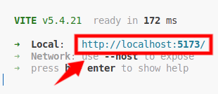

# 本项目基于 [jaywcjlove/linux-command](https://github.com/jaywcjlove/linux-command) 项目的[桌面版(by: haloislet)](https://github.com/haloislet/linux-command)使用AI重构

## 重构原因
#### 本人在使用桌面版源码运行时，`yarn`启动和响应速度实在是太感人，故决定使用`vue3+ts`重构项目，重构后速度明显提高

## 启动
### 1.安装依赖
```sh
pnpm i
```
### 2. 构建
```sh
pnpm build
```
### 4.启动
```sh
pnpm dev
```
### 5.点击控制台中的网址


## 后续计划
### 前后端分离，实现动态获取命令列表

## 感谢
- 1.感谢[jaywcjlove](https://github.com/jaywcjlove/linux-command)大神的web端程序
- 2.感谢[haloislet](https://github.com/haloislet/linux-command)大神的桌面版程序